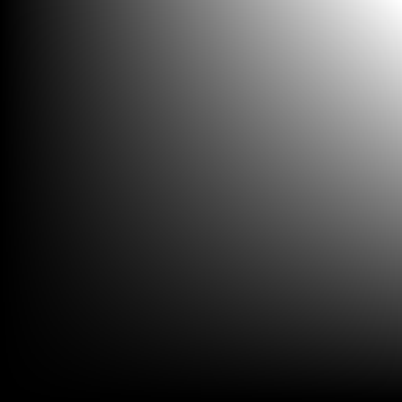
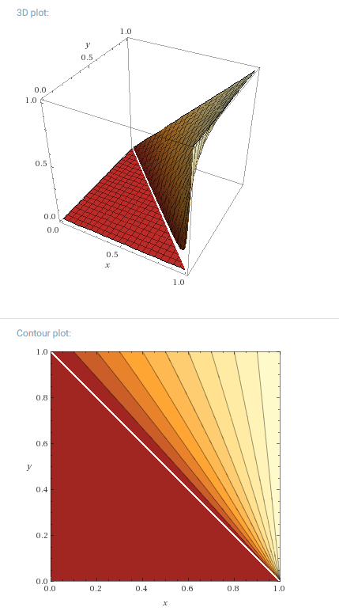
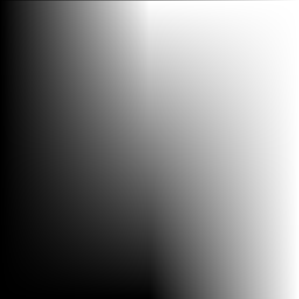
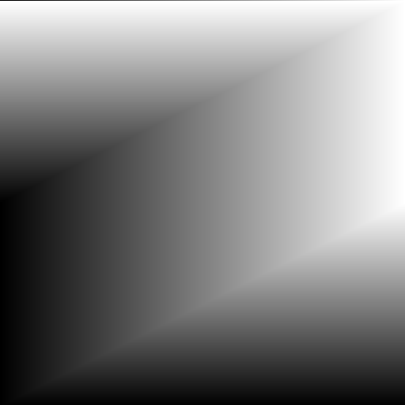
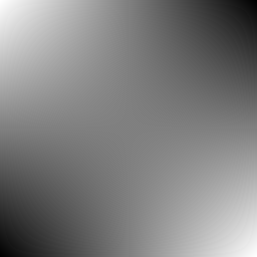
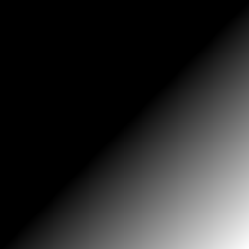
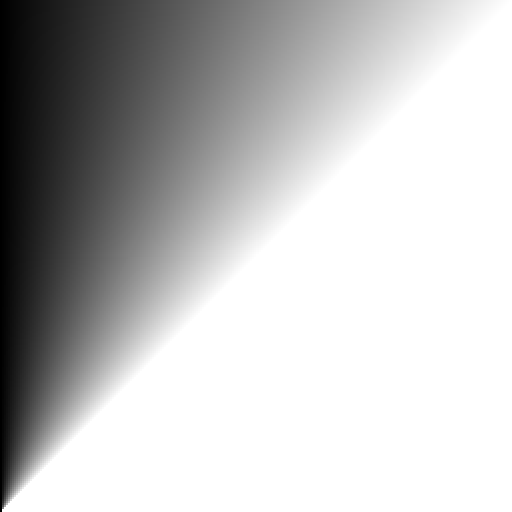

# 合成モード解説

Adobe Photoshop CC準拠。  
二枚のレイヤーを合成するときの計算式（C言語風）と、その性質について解説します。    

## はじめに

### 前提、凡例

色の三原色と不透明度、HSV表色系、簡単なC言語（最悪数式が読めればヨシ）は知っといてください。
min(a, b)はaとbの小さい方を、max(a, b)関数はaとbの大きい方を返します。
pow(a, b)はaのb乗を返します。random()は0から1の一様分布乱数を返します。

ここではxを下のレイヤーの色、yを上のレイヤーの色、zを計算結果の色とします。これらはそれぞれ色を表す構造体で、r,g,b,aのメンバーを持ちます。  
例えば、x.rは下のレイヤーの赤(red)、x.gは緑(green)、x.bは青(blue)、x.aは不透明度(alpha)の値です。y,zについても同様。  
それぞれの値は0～1の小数値とします（Adobeの引用の中では0～255になってますが、計算が面倒なので）。  

```
struct rgba {
  float r;
  float g;
  float b;
  float a;
}

float blend(rgba x, rgba y){
  rgba z;
  //ここのコードを以下で解説します
  return z;
}
```

##  一般論

3枚以上のレイヤの合成は、一番下の2枚を計算してから、その結果の上に3枚目を合成し、その結果の上に4枚目を……という手順のはずです。ちなみにレイヤーを結合するときに下から順にやらないと結果が変わってしまうのはこのせい。

計算結果が0～1の間に収まらない場合、0以下だったら0に、1以上だったら1になります。これをクリッピングとか飽和（saturate）とかいいます。いわゆる黒潰れとか白飛びとかです。

ディザ合成以外の合成モードで上のレイヤーの不透明度が1未満の場合、上のレイヤーの不透明度が1だったときの合成結果と下のレイヤーとを通常合成するだけのはず（未検証）。ただし、この処理は飽和処理の前に行われるので、飽和があった場合は結果が変わります。


### 双対

ブレンドモードには双対という概念があります（勝手に作った）。
```
blendA(x, y) = 1 - blendB(1 - x, 1 - y)
blendB(x, y) = 1 - blendA(1 - x, 1 - y)
```
が成り立っているとき、blendAとblendBを双対と呼びます。
blendAが暗くする効果を持つ時、blendBは明るくする効果を持ちます。


以下では、下のレイヤは左から右に向かって、上のレイヤは下から上に向かって明るくなるグラデーションを合成した結果を示します。
  

## 透明度系  

### 通常  

> 各ピクセルを編集またはペイントして結果色を作成します。これは、初期設定のモードです（通常モードは、モノクロ 2 階調画像やインデックスカラー画像で作業するときには、2 階調化と呼ばれます）。  

```  
z.r = y.r * y.a + x.r * (1 - y.a);  
z.g = y.g * y.a + x.g * (1 - y.a);  
z.b = y.b * y.a + x.b * (1 - y.a);  
z.a = y.a + x.a * (1 - y.a);  
```  

地味に一番厄介かもしれません。これはy.a、つまり上のレイヤーの不透明度に準じてrgbを線形補完している式です。  

y.aが1なら z = y と同じです。xに関わらず上のレイヤで完全に上書きします。  

  
  

### ディザ合成  

> 各ピクセルを編集またはペイントして結果色を作成します。ディザ合成モードの結果色は、ピクセルの不透明度に応じて基本色や合成色でランダムに置き換えられます。  

```  
if(y.a < random()){  
  z = x;  
} else {  
  z = y;  
}  
```  

乱数でどちらの色を採用するかか決めます。y.a（上の不透明度）が高いほどyが選ばれる確率が上がります。  

## 必ず暗くなる系  

ここから下はy.a=1として、不透明度についてのについての解説を省きます。（検証できてないので）  

### 比較（暗）  

> 各チャンネル内のカラー情報に基づき、基本色または合成色のいずれか暗い方を結果色として選択します。合成色よりも明るいピクセルが置き換えられ、合成色よりも暗いピクセルは変更されません。  

```  
// rgbそれぞれで計算しますが、略記します。
z = min(x, y);  
```  

rgbそれぞれで、xとyの小さい方の値を採用します。比較（明）の双対です。  
片方がrgbともに1ならもう片方の色がそのまま出ます。

  
  

### 乗算  

> 各チャンネル内のカラー情報に基づき、基本色と合成色を乗算します。結果色は暗いカラーになります。どのカラーも、ブラックで乗算すると結果はブラックになります。どのカラーも、ホワイトで乗算した場合は変更されません。ブラックまたはホワイト以外のカラーでペイントしている場合、ペイントツールで繰り返しストロークを描くとカラーは徐々に暗くなります。この効果は、複数のマーカーペンで描画したような効果が得られます。  

```  
// rgbそれぞれで計算しますが、略記します。
z = x * y;  
```  

xとyの値を単純に掛け算します。スクリーンの双対です。  
xが1のときはyの値そのままに、yが1のときはxの値そのままになります。また、xとyどちらか一方が0だと必ず0になります。  


  
  

### 焼き込みカラー  

> 各チャンネルのカラー情報に基づき、基本色を暗くして基本色と合成色のコントラストを強くし、合成色を反映します。ホワイトで合成した場合は、何も変更されません。  

```  
// rgbそれぞれで計算しますが、略記します。
z = 1 - (1 - x) / y;  
```  

覆い焼きカラーの双対です。  
xが1のときはyの色そのままになります。効果がとても強いです。  


  
  

### 焼き込み（リニア）  

> 各チャンネル内のカラー情報に基づき、基本色を暗くして明るさを落とし、合成色を反映します。ホワイトで合成した場合は、何も変更されません。  

```  
// rgbそれぞれで計算しますが、略記します。
z = x + y - 1;  
```  

覆い焼きリニア（加算）の双対です。  
x - (1 - y)の方が分かりやすいかもしれません。上のレイヤが白から離れた分暗くします。  
乗算よりは強い効果がありますが、焼き込みカラーほどではないです。

  
  

### カラー比較（暗）  

> 合成色と基本色について、すべてのチャンネル値の合計を比較し、値が低い方の色を表示します。カラー比較（暗）モードでは、基本色と合成色の両方のチャンネル値のうち最も低いものを選択することによって結果色が作成されるので、比較（暗）モードと異なり 3 番目の色は生成されません。  

```  
if(0.3 * x.r + 0.6 * x.g + 0.1 * x.b <  
  0.3 * y.r + 0.6 * y.g + 0.1 * y.b)  
  z = x;  
else  
  z = y;    
```  

名前は比較（暗）に似てますが、rgbそれぞれで小さい方を採用するのではなく、rgb合わせた輝度が小さい方のrgbを採用する点が違います。輝度はrgbを3:6:1くらいで混ぜると得られます。  
つまり出力は(不透明度が1なら)必ずxとyどちらかの色になります。  
カラー比較（明）の双対です。


## 必ず明るくなる系  

### 比較（明）  

> 各チャンネル内のカラー情報に基づき、基本色または合成色のいずれか明るい方を結果色として選択します。合成色よりも暗いピクセルが置き換えられ、合成色よりも明るいピクセルは変更されません。  


```  
// rgbそれぞれで計算しますが、略記します。
z = max(x, y);  
```  

比較（暗）の双対です。

  
  

### スクリーン  

> 各チャンネル内のカラー情報に基づき、合成色と基本色を反転したカラーを乗算します。結果色は明るいカラーになります。ブラックでスクリーニングすると、カラーは変更されません。ホワイトでスクリーニングすると、ホワイトになります。この効果は、複数の写真スライドを重ね合わせて投影したような効果が得られます。  

```  
// rgbそれぞれで計算しますが、略記します。
z = 1 - (1 - x) * (1 - y);  
```  

乗算の双対です。  
xが0のときはyの値そのままに、yが0のときはxの値そのままになります。また、xとyどちらか一方が1だと必ず1になります。  


  
  

### 覆い焼きカラー  

> 各チャンネルのカラー情報に基づき、基本色を明るくして基本色と合成色のコントラストを落とし、合成色を反映します。ブラックと合成しても変化はありません。  

```  
// rgbそれぞれで計算しますが、略記します。
z = x / (1 - y)  
```  

焼き込みカラーの双対です。  


  
  

### 覆い焼き（リニア）- 加算  

> 各チャンネル内のカラー情報に基づき、基本色を明るくして明るさを増し、合成色を反映します。ブラックと合成しても変化はありません。  

```  
// rgbそれぞれで計算しますが、略記します。
z = x + y  
```  

xとyを単純に足します。焼き込みリニアの双対です  

  
  

### カラー比較（明）  

> 合成色と基本色について、すべてのチャンネル値の合計を比較し、値が高い方の色を表示します。カラー比較（明）モードでは、基本色と合成色の両方のチャンネル値のうち最も高いものを選択することによって結果色が作成されるので、比較（明）モードと異なり 3 番目の色は生成されません。  


```  
if(0.3 * x.r + 0.6 * x.g + 0.1 * x.b <  
  0.3 * y.r + 0.6 * y.g + 0.1 * y.b)  
  z = y;  
else  
  z = x;    
```  

名前は比較（明）に似てますが、rgbそれぞれで大きい方を採用するのではなく、rgb合わせた輝度が大きい方のrgbを採用する点で違います。輝度はrgbを3:6:1くらいで混ぜると得られます。  
つまり出力は(不透明度が1なら)必ずxとyどちらかの色になります。  
カラー比較（暗）の双対です。

## コントラスト上げる系  

オーバーレイは下の、それ以外は上のレイヤーの値を基準に条件分岐し、明るい色の時は明るくする系の合成を、暗い色の時はより暗くする系の合成をします。  

### オーバーレイ  

> 基本色に応じて、カラーを乗算またはスクリーンします。基本色のハイライトおよびシャドウを保持しながら、パターンまたはカラーを既存のピクセルに重ねます。基本色は、置き換えられませんが、合成色と混合されて基本色の明るさまたは暗さを反映します。  

```  
// rgbそれぞれで計算しますが、略記します。
if(x < 0.5)  
  z = 2 * x * y;  
else  
  z = 1 - 2 * (1 - x) * (1 - y);  
```  

x、つまり下のレイヤーの値が0.5未満のときは乗算に、0.5以上のときはスクリーンになります。  
ただし、乗算するときはxの0～0.5を0～1にマッピングしなおしたものを乗算し、スクリーンするときは0.5～1を0～1にマッピングしなおしたものをスクリーンします（式中で2倍してますね）。  

なお、コントラスト上げる系の中で下のレイヤを基準に分岐するのはオーバーレイだけです。  

  
  

### ソフトライト  

> 合成色に応じて、カラーを暗くまたは明るくします。画像上でスポットライトを照らしたような効果が得られます。合成色（光源）が 50 ％グレーよりも明るい場合、画像は覆い焼きされたかのように明るくなります。合成色が 50 ％グレーよりも暗い場合、画像は焼き込んだように暗くなります。純粋な黒または白でペイントすると、その部分の明暗ははっきりしますが、純粋な黒または白にはなりません。  

```
// rgbそれぞれで計算しますが、略記します。
if(y < 0.5)  
  z = pow(x, 2 - 2 * y)
else
  z = pow(x, 1 / ( 2 * y ))
```

ソフトライトは対応する明るくする系や暗くする系の合成モードがありません。（欲しい）
上のレイヤを基準に分岐し、それぞれ指数関数を使って処理します。

  
  


### ハードライト  

> 合成色に応じて、カラーを乗算またはスクリーンします。画像上で直接スポットライトを照らしたような効果が得られます。合成色（光源）が 50 ％グレーよりも明るい場合、画像はスクリーンされたかのように明るくなります。これは、画像にハイライトを追加するときに役立ちます。合成色が 50 ％グレーよりも暗い場合、画像は乗算されたかのように暗くなります。これは、画像にシャドウを追加するときに役立ちます。純粋なホワイトまたはブラックでペイントすると、純粋なホワイトまたはブラックになります。  

```  
// rgbそれぞれで計算しますが、略記します。
if(y < 0.5)
  z = x * y * 2;  
else
  z = 1 - 2 * (1-x) * (1-y);    
```  

判定に使うのが上のレイヤになった以外、オーバーレイと同じです。  
yが0のときはzも0、yが1のときはzも1、yが0.5のときはzはxの値そのままになります。  

  
  

### ビビッドライト  

> 合成色に応じてコントラストを増加または減少させ、カラーの焼き込みまたは覆い焼きを行います。合成色（光源）が 50 ％グレーより明るい場合は、コントラストを落として画像を明るくします。合成色が 50 ％グレーより暗い場合は、コントラストを上げて画像を暗くします。  

```
// rgbそれぞれで計算しますが、略記します。
if(y < 0.5)
  z = 1 - (1 - x) / (2 * y)
else
  z = x / (2 - 2 * y)
```

yが0.5未満のときは焼き込みカラーのように、0.5以上のときは覆い焼きカラーのように合成します。  
yが0のときはzも0、yが1のときはzも1、yが0.5のときはzはxの値そのままになります。  

  
  

### リニアライト  

> 合成色に応じて明るさを減少または増加させ、カラーの焼き込みまたは覆い焼きを行います。合成色（光源）が 50 ％グレーより明るい場合は、明るさを増して画像を明るくします。合成色が 50 ％グレーより暗い場合は、明るさを落として画像を暗くします。  

```
// rgbそれぞれで計算しますが、略記します。
z = x + 2 * y - 1
```

上のレイヤーが0.5未満のときは焼き込みリニアのように、0.5以上のときは覆い焼きリニアのように合成します。……が、これは条件分岐なしで書けます。

  
  

### ピンライト  

> 合成色に応じて、カラーが置換されます。合成色（光源）が 50 ％グレーより明るい場合、合成色より暗いピクセルは置換されます。合成色より明るいピクセルは、変更されません。合成色が 50 ％グレーより暗い場合、合成色より明るいピクセルは置換されます。合成色より暗いピクセルは変更されません。これは、画像に特殊効果を追加するときに役立ちます。  

```
// rgbそれぞれで計算しますが、略記します。
z = max(min(x, 2 * y), 2 * y - 1)
```

上のレイヤーが0.5未満のときは比較（暗）のように、0.5以上のときは比較（明）のように合成します。…が、これは条件分岐なしで書けます。

  
  

### ハードミックス  

> 合成色のレッド、グリーンおよびブルーの各チャンネル値を基本色の RGB 値に追加します。合計が 255 以上のチャンネルは、値 255 を受け取り、合計が 255 未満のチャンネルは、値 0 を受け取ります。したがって、合成されるすべてのピクセルに、0 または 255 のいずれかの RGB 値が割り当てられます。これにより、全ピクセルが加法原色（赤、緑または青）、白または黒に変わります。  

```  
// rgbそれぞれで計算しますが、略記します。
if(x + y < 1) {  
  z = 0;  
} else {  
  z = 1;    
}  
```  

  
  


## その他  

### 差の絶対値  

> 各チャンネル内のカラー情報に基づいて、合成色を基本色から取り除くか、基本色を合成色から取り除きます。明るさの値の大きい方のカラーから小さい方のカラーを取り除きます。ホワイトと合成すると基本色の値が反転しますが、ブラックと合成しても変化はありません。  

```  
// rgbそれぞれで計算しますが、略記します。
if(0 < x - y) {  
  z = x - y;  
} else {  
  z = y - x;
}  
```  
文字通り、|x-y|です。

  
  

### 除外  

> 差の絶対値モードと似ていますが、効果のコントラストはより低くなります。ホワイトと合成すると、基本色の値が反転しますが、ブラックと合成しても変化はありません。  

```  
// rgbそれぞれで計算しますが、略記します。
z = x + y - 2 * x * y;
```  

謎。2(x - 0.5)(y - 0.5) + 0.5ということなんだろうけど……。

  
  

### 減算  

> 各チャンネル内のカラー情報に基づき、基本色から合成色を減算します。8 ビットおよび 16 ビット画像で、結果の負の値が 0 にクリッピングされます。  


```  
// rgbそれぞれで計算しますが、略記します。
z = x - y;
```  

文字通り、x-yです。

  
  

### 除算  

> 各チャンネル内のカラー情報に基づき、基本色と合成色を分けます。  

```  
// rgbそれぞれで計算しますが、略記します。
z = x / y;
```  

文字通り、x/yです。ヘルプの翻訳がガバガバ。

  
  

## HSV系

ここではHSV変換が必要なので、2つの関数を導入します。具体的な実装はググってください。
（……これPhotoshopの実装はhsv表色系じゃなくてマンセル表色系っぽいです。罠）
```
struct hsva {
  float h;
  float s;
  float v;
  floar a;
}

hsva RGBtoHSV(rgba x){

}
rgba HSVtoRGB(hsva x){

}
```

ここでは、下のレイヤにlennaを、上のレイヤにhsvレインボーを合成した結果を示します。
  

### 色相  

> ベースカラーの輝度と彩度、およびブレンドカラーの色相を持つ最終カラーが作成されます。  

```  
hsva X = RGBtoHSV(x);
hsva Y = RGBtoHSV(y);
hsva Z;
Z.h = Y.h;
Z.s = X.s;
Z.v = X.v;
z = HSVtoRGB(Z);
```  

色相だけ上のレイヤーのを採用します。アルファの挙動は確認してません…

  

### 彩度  

> 基本色の輝度と色相および合成色の彩度を使用して、結果色を作成します。このモードで彩度ゼロ（グレー）の領域をペイントした場合は、何も変更されません。  

```  
hsva X = RGBtoHSV(x);
hsva Y = RGBtoHSV(y);
hsva Z;
Z.h = X.h;
Z.s = Y.s;
Z.v = X.v;
z = HSVtoRGB(Z);
```  

彩度だけ上のレイヤのを採用します。  

  

### カラー  

> 基本色の輝度と、合成色の色相および彩度を使用して、結果色を作成します。これにより、画像内のグレーレベルが保持され、モノクロ画像のカラー化およびカラー画像の階調化に役立ちます。  

```  
hsva X = RGBtoHSV(x);
hsva Y = RGBtoHSV(y);
hsva Z;
Z.h = Y.h;
Z.s = Y.s;
Z.v = X.v;
z = HSVtoRGB(Z);
```  
色相と彩度だけ上のレイヤのを採用します。  

  

### 輝度  

> 基本色の色相および彩度と、合成色の輝度を使用して、結果色を作成します。このモードでは、カラーモードの反対の効果が作成されます。  

```  
hsva X = RGBtoHSV(x);
hsva Y = RGBtoHSV(y);
hsva Z;
Z.h = X.h;
Z.s = X.s;
Z.v = Y.v;
z = HSVtoRGB(Z);
```  

輝度だけ上のレイヤのを採用します。

  


## 出典、参考文献など
+ [Adobe Photoshop での描画モード - Adobe Help Center](https://helpx.adobe.com/jp/photoshop/using/blending-modes.html)
+ [osakana.factory | ブレンドモード詳説](https://ofo.jp/osakana/cgtips/blendmode.phtml)
+ [WolframAlpha](https://www.wolframalpha.com/)
